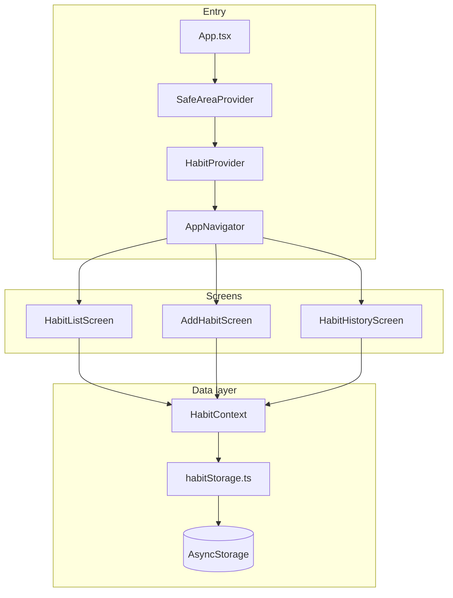
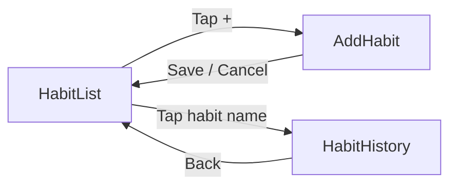
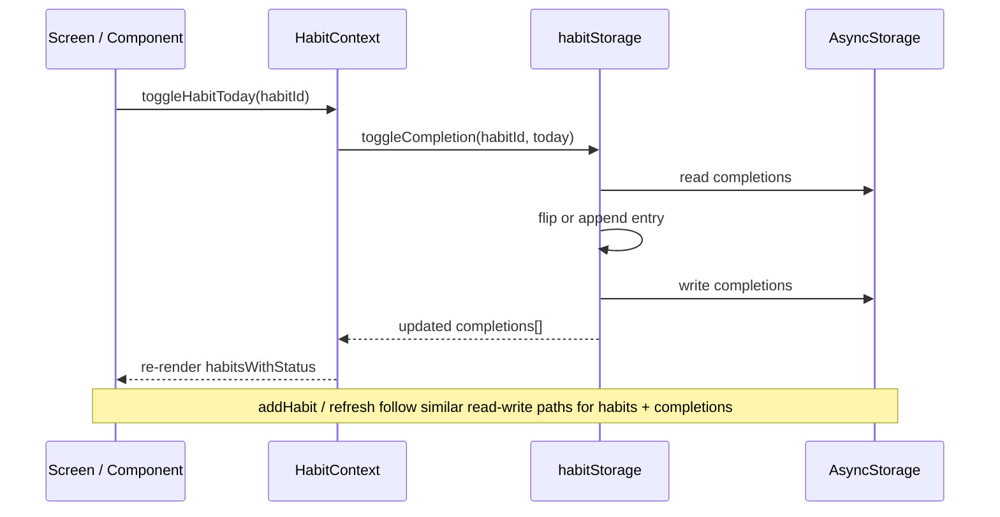

# DailyBit — App Flow

DailyBit is a React Native habit tracker. Users add daily habits, mark them complete for today, and view streaks and a 7-day history per habit. All data is stored locally on the device (AsyncStorage).

---

## High-level architecture

---

## Startup flow

1. `**App.tsx**` wraps the app in `SafeAreaProvider`, sets the status bar style from the system theme, and mounts `**HabitProvider**` + `**AppNavigator**`.
2. `**HabitProvider**` loads habits and completions from AsyncStorage on mount (`loading = true` until finished).
3. `**AppNavigator**` shows the stack with `**HabitList**` as the initial screen (no header).

---

## Navigation flow

| Screen        | Route          | How you get there        | How you leave                             |
| ------------- | -------------- | ------------------------ | ----------------------------------------- |
| Habit list    | `HabitList`    | App launch (default)     | `+` → Add Habit; tap habit name → History |
| Add habit     | `AddHabit`     | Tap `+` on list          | Save → back to list; Cancel → back        |
| Habit history | `HabitHistory` | Tap habit name on a card | Back button / gesture                     |

**Route params**

- `HabitHistory`: `{ habitId: string, habitName: string }` — used for stats, chart, and header title.

---

## Habit list flow (main screen)

1. Screen reads `**habitsWithStatus`** from `useHabits()` (each habit + `completedToday` + `streak`).
2. **Pull to refresh** calls `refresh()` to reload from storage.
3. **Checkbox** → `toggleHabitToday(habitId)`:
  - Haptic feedback (`triggerToggleHaptic`)
  - Updates completion for **today** in AsyncStorage
  - UI updates streak badge and strikethrough on the name
4. **Tap habit name area** → navigate to `HabitHistory` with that habit’s id and name.
5. **Empty list** → `EmptyState` prompts user to add a habit via `+`.

**Streak on list (before/after done)**

- Streak counts consecutive completed days ending **today** if today is done, otherwise ending **yesterday** (so you still see 🔥 before checking today off).

---

## Add habit flow

1. User enters a name (max 50 characters, `MAX_HABIT_NAME_LENGTH`).
2. Validation: non-empty trimmed name, length limit.
3. **Save** → `addHabit(name)`:
  - Creates habit with generated id and `createdAt`
  - Persists via `saveHabit` → `refresh()` → `navigation.goBack()`
4. **Cancel** → `goBack()` without saving.

---

## Habit history flow

1. Receives `habitId` from navigation.
2. Builds **last 7 days** of data from `completions` in context.
3. **Stats row**: current streak, completed count (7d), best streak in window.
4. **Contribution map**: 7 tappable squares; tap shows detail line (Completed / Pending / Not completed).
5. **Day by day** list (newest first):
  - **Done** — green badge
  - **Pending** — today, not yet completed
  - **Missed** — past day, not completed

Today’s row is highlighted with `primaryMuted` background.

---

## Data flow (completions)

**Storage keys**

- `@dailybit:habits` — array of `Habit`
- `@dailybit:completions` — array of `HabitCompletion` (`habitId`, `date` YYYY-MM-DD, `completed`)

---

## Theme flow

- System light/dark mode → `useTheme()` / `getColors(scheme)` → screens and components.
- Navigation theme in `AppNavigator` is synced with the same palette (background, surface, primary, text, border).

---

## File roles in the flow (quick map)

| Layer       | Files                                                                                 |
| ----------- | ------------------------------------------------------------------------------------- |
| Entry       | `App.tsx` (project root)                                                              |
| Navigation  | `navigation/AppNavigator.tsx`, `navigation/types.ts`                                  |
| State       | `context/HabitContext.tsx`                                                            |
| Persistence | `storage/habitStorage.ts`                                                             |
| UI          | `screens/`*, `components/*`                                                           |
| Logic       | `utils/streakCalculator.ts`, `utils/dateHelpers.ts`, `utils/chartDataTransformers.ts` |
| Types       | `types.ts`, `constants.ts`                                                            |

For per-file features, see [SRC_REFERENCE.md](./SRC_REFERENCE.md).