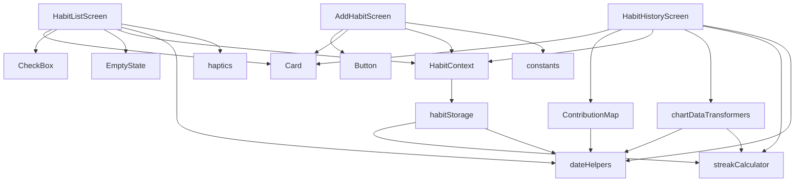

# DailyBit — `src` folder reference

Overview of every file under `src/`: what it does and how it fits together.

```
src/
├── components/       Reusable UI
├── constants.ts      App-wide constants
├── context/          Global habit state
├── navigation/       Stack navigator + route types
├── screens/          Full-screen views
├── storage/          AsyncStorage persistence
├── styles/           Theme, spacing, typography
├── types.ts          Shared TypeScript models
└── utils/            Dates, streaks, haptics, chart data
```

---

## `types.ts`

Shared data models:

| Type | Purpose |
|------|---------|
| `Habit` | `id`, `name`, `createdAt` (ISO string) |
| `HabitCompletion` | `habitId`, `date` (`YYYY-MM-DD`), `completed` |
| `HabitWithTodayStatus` | `habit` + `completedToday` + `streak` (for list UI) |
| `ContributionDataPoint` | `date` + `count` (0 or 1) for the 7-day map |

---

## `constants.ts`

| Export | Value | Used for |
|--------|-------|----------|
| `MAX_HABIT_NAME_LENGTH` | `50` | Add habit input validation and `maxLength` |

---

## Context

### `context/HabitContext.tsx`

**Role:** Single source of truth for habits and completions across screens.

| Export | Description |
|--------|-------------|
| `HabitProvider` | Loads data on mount; provides context to children |
| `useHabits()` | Hook — throws if used outside provider |

**Context value**

| Field | Description |
|-------|-------------|
| `habits` | Raw habit list from storage |
| `completions` | All completion records |
| `habitsWithStatus` | Derived list for the home screen |
| `loading` | `true` during initial load |
| `refresh()` | Reload habits + completions from AsyncStorage |
| `addHabit(name)` | Create habit, save, refresh |
| `toggleHabitToday(habitId)` | Toggle today’s completion for one habit |

---

## Navigation

### `navigation/types.ts`

- `RootStackParamList` — stack route names and params
- Typed screen props: `HabitListScreenProps`, `AddHabitScreenProps`, `HabitHistoryScreenProps`

### `navigation/AppNavigator.tsx`

- `NavigationContainer` with light/dark theme from `getColors`
- Stack screens: `HabitList` (no header), `AddHabit`, `HabitHistory` (title = habit name)
- Imports all three screens and wires stack options

---

## Screens

### `screens/HabitListScreen.tsx`

**Purpose:** Home screen — today’s habits.

| Feature | Implementation |
|---------|----------------|
| Header | “Today” + formatted date + `+` button → Add Habit |
| Habit cards | `FlatList` of `Card` + `CheckBox` + name + `StreakBadge` |
| Toggle complete | Checkbox → haptic + `toggleHabitToday` |
| Open history | Press habit text area → `HabitHistory` |
| Pull to refresh | `RefreshControl` → `refresh()` |
| Empty state | `EmptyState` when no habits |
| Loading | `ActivityIndicator` while `loading` |
| `StreakBadge` (local) | 🔥 + count when streak > 0; else “0 days” |

### `screens/AddHabitScreen.tsx`

**Purpose:** Create a new habit.

| Feature | Implementation |
|---------|----------------|
| Name input | `TextInput`, autofocus, character counter |
| Validation | Empty name, max length errors |
| Save | `Button` primary → `addHabit` → go back |
| Cancel | `Button` ghost → go back |
| Layout | `KeyboardAvoidingView` + `ScrollView` + `Card` |

### `screens/HabitHistoryScreen.tsx`

**Purpose:** Stats and 7-day history for one habit.

| Feature | Implementation |
|---------|----------------|
| Stats | `StatCard` × 3: current streak, last 7 days ratio, best streak in 7d |
| Contribution map | `ContributionMap` + selected day detail text |
| Day by day | Reversed last 7 days with **Done** / **Pending** / **Missed** |
| Helpers (local) | `getDayStatus`, `getDayStatusDetail`, `StatCard` |

Uses: `streakCalculator`, `chartDataTransformers`, `dateHelpers`.

---

## Components

### `components/Card.tsx`

- Themed surface container (border, padding, shadow; shadow off in dark mode)
- Accepts optional `style` override
- Used on list items, add habit form, history sections

### `components/Button.tsx`

| Prop | Description |
|------|-------------|
| `label` | Button text |
| `variant` | `primary` \| `secondary` \| `ghost` |
| `loading` | Shows spinner, disables press |
| `disabled` | Reduced opacity |

Press feedback: scale + opacity. Themed via `useTheme`.

### `components/CheckBox.tsx`

- Circular checkbox with ✓ when checked
- Scale animation on toggle (`Animated`)
- `accessibilityRole="checkbox"` + `accessibilityState`
- Used on habit list for “done today”

### `components/EmptyState.tsx`

| Prop | Default | Description |
|------|---------|-------------|
| `title` | — | Main message |
| `message` | — | Subtitle |
| `emoji` | `🌱` | Large emoji above title |

Centered layout for empty habit list.

### `components/ContributionMap.tsx`

**Purpose:** 7-day horizontal row of squares (replaces chart-kit for short ranges).

| Prop | Description |
|------|-------------|
| `values` | `ContributionDataPoint[]` |
| `selectedDay` | Highlight border on selected square |
| `today` | Date string for pending styling |
| `onDayPress` | Callback with `date` |

| Square state | Color |
|--------------|--------|
| Completed | `success` |
| Today, not done | `primaryMuted` (pending) |
| Other, not done | `contributionEmpty` |

Weekday label under each square (`getShortWeekday`).

---

## Storage

### `storage/habitStorage.ts`

AsyncStorage API for habits and completions.

| Function | Description |
|----------|-------------|
| `getHabits()` | Read all habits |
| `saveHabit(habit)` | Append one habit |
| `deleteHabit(id)` | Remove habit and its completions |
| `getCompletions()` | Read all completions |
| `isCompletedOnDate(habitId, date, completions)` | Sync check for UI |
| `toggleCompletion(habitId, date?)` | Flip existing or add `completed: true`; persists |
| `getStreakForHabit(habitId, completions)` | Delegates to `calculateStreak` |
| `createHabitId()` | Unique id: `habit_{timestamp}_{random}` |

**Keys:** `@dailybit:habits`, `@dailybit:completions`

---

## Utils

### `utils/dateHelpers.ts`

| Function | Description |
|----------|-------------|
| `formatDate(date)` | `YYYY-MM-DD` (local) |
| `parseDate(string)` | Local midnight `Date` |
| `addDays(date, n)` | Shift calendar days |
| `getLastNDates(n)` | Last N days ending today, oldest first |
| `formatDisplayDate(string)` | e.g. “Fri, May 29” |
| `formatHeaderDate(date?)` | Long header date for list screen |
| `getShortWeekday(string)` | e.g. “Mon” |

### `utils/streakCalculator.ts`

| Function | Description |
|----------|-------------|
| `calculateStreak(habitId, completions, today?)` | Consecutive days ending today (if done) or yesterday |
| `calculateBestStreakInWindow(habitId, completions, dates)` | Longest run in a date array |
| `countCompletedInWindow(habitId, completions, dates)` | Count of completed days in window |
| `HISTORY_DAYS` | `7` — history window length |

### `utils/chartDataTransformers.ts`

| Function | Description |
|----------|-------------|
| `toContributionValues(habitId, completions, numDays?)` | Maps last N dates to `{ date, count: 0 \| 1 }` for `ContributionMap` |

### `utils/haptics.ts`

| Function | Description |
|----------|-------------|
| `triggerToggleHaptic()` | Short `Vibration` on habit toggle (Android 12ms, iOS 10ms). Requires `VIBRATE` permission on Android. |

---

## Styles

### `styles/colors.ts`

- `ThemeColors` type and `getColors(scheme)`
- Light and dark palettes: background, surface, primary, success, streak, text, borders, `contributionEmpty`, etc.

### `styles/spacing.ts`

- `spacing` scale (`xs` → `xxl`)
- `radius` (`sm`, `md`, `lg`, `full`)

### `styles/typography.ts`

- Shared text styles: `title`, `heading`, `body`, `bodyMedium`, `caption`, `label`

### `styles/useTheme.ts`

- `useTheme()` → `{ colors, scheme }` from system `useColorScheme`

---

## Dependency graph (screens → internals)



---

## Related files outside `src/`

| File | Role |
|------|------|
| `App.tsx` | Root component, providers, status bar |
| `index.js` | Registers root component with React Native |
| `android/app/src/main/AndroidManifest.xml` | Includes `INTERNET`, `VIBRATE` permissions |
| `metro.config.js` | Metro bundler; excludes Gradle caches under `node_modules` |

---

## See also

- [APP_FLOW.md](./APP_FLOW.md) — navigation, user journeys, and sequence diagrams
